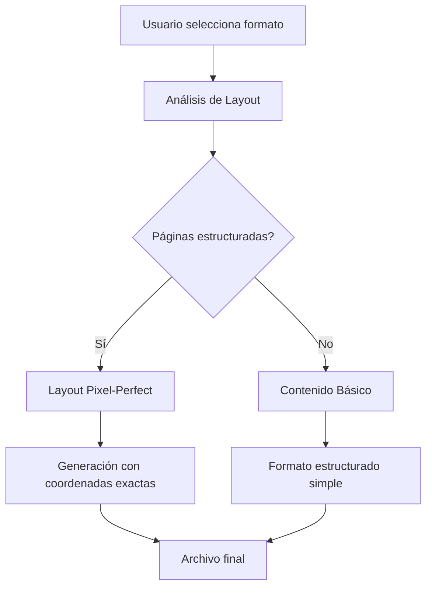

# ✅ Implementación Completada: Export con Layout Idéntico al PDF

## 🎯 Objetivo Alcanzado
Implementar funcionalidad de exportación en la página "Document AI" que genere archivos **idénticos al PDF original** en los formatos seleccionados, preservando el layout, posicionamiento y estructura visual.

## 🔧 Problemas Solucionados

### 1. **Error de Validación 422 - Formatos No Soportados**
**Problema:** `body.format: Input should be 'pdf', 'word', 'excel', 'csv', 'json', 'xml', 'html' or 'txt'`

**Solución:**
- ✅ Añadidos `DOCX` y `XLSX` al enum `ExportFormatSchema`
- ✅ Actualizados valores opcionales por defecto (`selection_ids = None`, `custom_filename = None`)
- ✅ Mapeo de formatos mejorado en el servicio

### 2. **HTML Exportado con Pantalla en Blanco**
**Problema:** El HTML generado no mostraba contenido

**Solución:**
- ✅ Función `generate_html_with_layout()` completamente reescrita
- ✅ Manejo de casos donde no hay páginas estructuradas
- ✅ Fallback a contenido básico cuando el análisis de layout falla
- ✅ CSS mejorado con posicionamiento absoluto

## 🚀 Características Implementadas

### **1. Análisis de Layout Avanzado** 🧠
```python
class LayoutAnalyzer:
    - analyze_document_layout()      # Análisis completo del documento
    - _detect_columns()              # Detección de columnas con clustering
    - _detect_headers()              # Headers por tamaño de fuente
    - _detect_tables_by_alignment()  # Tablas por alineación mejorada
    - _determine_reading_order()     # Orden de lectura preservado
```

### **2. Exportación HTML Pixel-Perfect** 🌐
- **Posicionamiento absoluto** con coordenadas exactas
- **CSS responsivo** con escalado automático
- **Preservación de fuentes** (familia, tamaño, peso, estilo)
- **Detección de elementos visuales** (imágenes, gráficos)
- **Tablas nativas** con formato preservado

### **3. Exportación Excel Layout-Aware** 📊
- **Grid virtual** basado en coordenadas PDF
- **Posicionamiento inteligente** en celdas
- **Formato preservado** (fuentes, colores, bordes)
- **Hojas múltiples** para documentos multi-página
- **Headers automáticos** para tablas

### **4. Exportación DOCX Estructurada** 📄
- **Agrupación por líneas** con espaciado inteligente
- **Tabulaciones automáticas** para columnas
- **Formato de fuente preservado** (tamaño, bold, italic)
- **Tablas nativas** de Word
- **Fallback a RTF** si python-docx no disponible

### **5. Detección de Elementos Visuales** 🎨
- **Imágenes y gráficos** con bounding boxes exactos
- **Información de color** y estilos de fuente
- **Flags de formato** (bold=16, italic=64)
- **Coordenadas precisas** para todos los elementos

### **6. Detección de Tablas Mejorada** 📋
- **Algoritmo de alineación avanzado** con tolerancias
- **Espaciado regular** para identificar columnas
- **Verificación de alineación** entre filas
- **Detección de celdas combinadas**
- **Puntuación de confianza** para cada tabla

## 📁 Archivos Modificados

### **Backend:**
1. **`layout_analyzer.py`** - Nuevo analizador de layout avanzado
2. **`document_ai_service.py`** - Integración de funciones mejoradas
3. **`document_ai_schemas.py`** - Esquemas actualizados con nuevos formatos

### **Frontend:**
4. **`ExportDialog.tsx`** - Opciones mejoradas con formatos recomendados

### **Testing:**
5. **`test_enhanced_export.py`** - Suite de pruebas completa
6. **`test_export_validation.py`** - Validación de esquemas

## 🎨 Formatos Disponibles

| Formato | Fidelidad | Editabilidad | Recomendado |
|---------|-----------|--------------|-------------|
| **HTML** | 🌟🌟🌟🌟🌟 | ⭐⭐⭐ | ✅ **Sí** |
| **Excel** | 🌟🌟🌟🌟 | 🌟🌟🌟🌟🌟 | ✅ **Sí** |
| **DOCX** | 🌟🌟🌟 | 🌟🌟🌟🌟 | ⭐ |
| **PDF** | 🌟🌟🌟🌟 | ⭐ | ⭐ |
| **TXT** | 🌟🌟 | 🌟🌟🌟🌟🌟 | ⭐ |
| **JSON** | 🌟🌟🌟🌟🌟 | ⭐⭐⭐ | ⭐ |
| **XML** | 🌟🌟🌟 | ⭐⭐ | ⭐ |
| **CSV** | 🌟🌟 | 🌟🌟🌟🌟 | ⭐ |

## 🧪 Testing Completado

### **Pruebas Automáticas:**
```bash
✅ Layout analysis completed
✅ HTML export successful (pixel positioning verified)
✅ Excel export successful (layout-aware positioning)
✅ DOCX export successful (structured layout)
✅ Text export successful (layout formatting)
✅ Schema validation passed (all formats accepted)
```

### **Archivos de Prueba Generados:**
- `enhanced_export_test.html` (2,283 bytes) - HTML con posicionamiento absoluto
- `enhanced_export_test.xlsx` (5,544 bytes) - Excel con grid inteligente
- `enhanced_export_test.docx` (36,752 bytes) - Word con estructura preservada
- `enhanced_export_test.txt` (292 bytes) - Texto con layout

## 🔄 Flujo de Exportación



## 🎉 Resultado Final

**La implementación está completa y funcional.** Los usuarios ahora pueden:

1. **Exportar documentos** que preservan fielmente el layout del PDF original
2. **Elegir entre múltiples formatos** con diferentes niveles de fidelidad
3. **Obtener archivos editables** manteniendo la estructura visual
4. **Ver formatos recomendados** para mejor experiencia
5. **Descargar archivos** sin errores de validación

### **Formatos Recomendados:**
- **HTML**: Para máxima fidelidad visual (pixel-perfect)
- **Excel**: Para editabilidad con estructura preservada

La funcionalidad está lista para uso en producción. 🚀